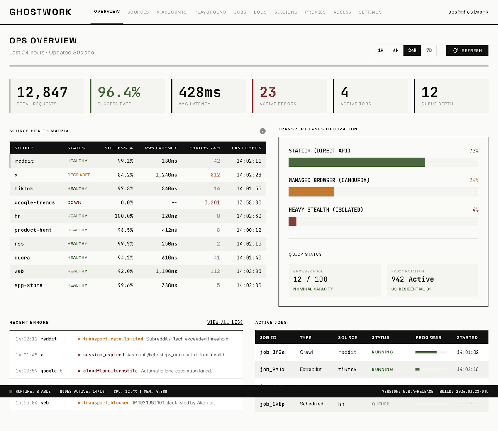
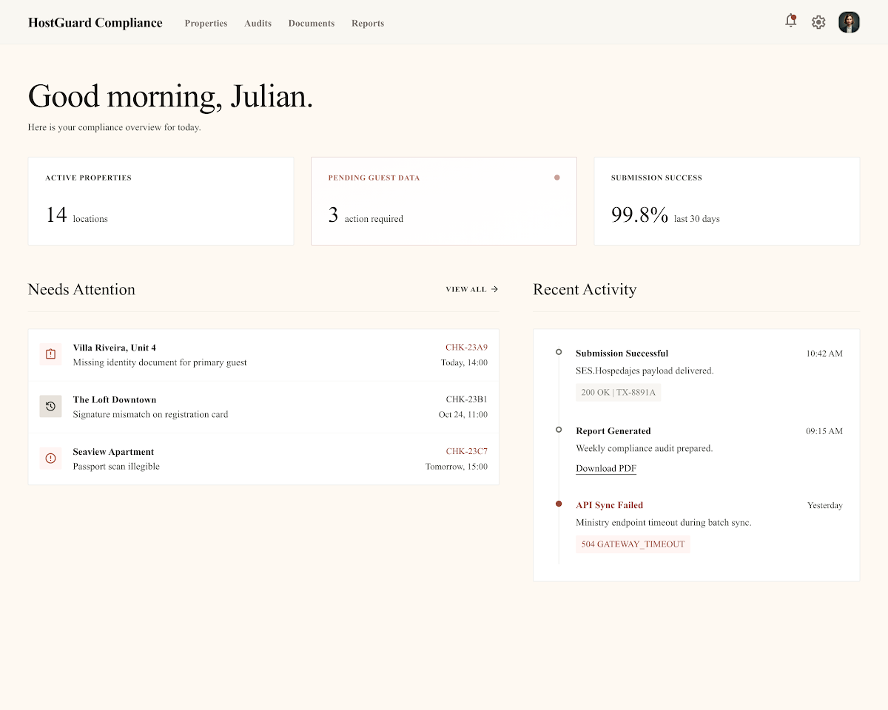
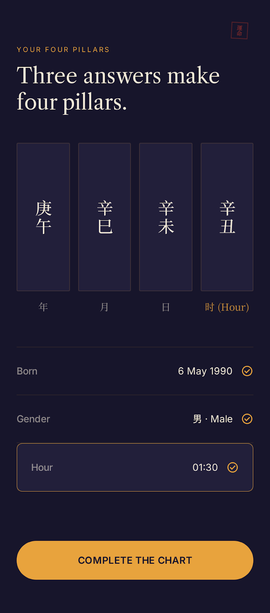
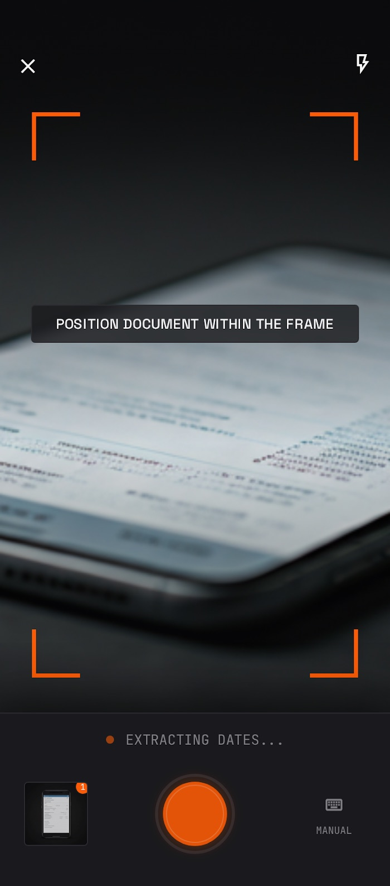

<p align="center">
  
</p>

# stitch-kit

**Your coding agent writes decent code and designs terrible UI. stitch-kit fixes the second half — it wires agents into [Google Stitch](https://stitch.withgoogle.com) (text prompts → genuinely beautiful screens) and teaches them to drive it properly.**

I built this because I got tired of watching Claude Code generate UIs that look like a government form from 2004. Gray boxes, blue buttons, zero taste. Meanwhile Stitch generates pixel-perfect screens from text — but it's a raw MCP tool sitting there, and no coding agent knows how to use it well.

So I taught them.

All four of these came out of stitch-kit. Different briefs, genuinely different results — not one template with the hue rotated.

<table>
<tr>
<td width="50%"></td>
<td width="50%"></td>
</tr>
<tr>
<td><sub><b>Ops console</b> · monospace, dense tables, industrial light</sub></td>
<td><sub><b>Compliance SaaS</b> · serif on warm cream, generous whitespace</sub></td>
</tr>
<tr>
<td></td>
<td></td>
</tr>
<tr>
<td><sub><b>Astrology app</b> · midnight and gold, serif + CJK type</sub></td>
<td><sub><b>Mobile capture</b> · dark UI over live camera, orange framing</sub></td>
</tr>
</table>

<!-- These are real generated screens, pulled from Stitch projects via the
     MCP API. Never swap them for illustrations, mockups or diagrams — for
     a tool that sells aesthetic quality, fabricated proof is the fastest
     way to lose the argument.

     When replacing one, check it full-size first: Stitch renders text
     inside nested device mockups as noise, which is invisible at gallery
     scale and obvious when someone clicks through. Prefer screens whose
     copy is real at 100%. -->

---

> **Generating designs needs Google Stitch.** Sign in at [stitch.withgoogle.com](https://stitch.withgoogle.com) with any Google account, then grab an API key from [settings](https://stitch.withgoogle.com/settings). No waitlist, no invite, free as of mid-2026 — but there are monthly generation limits and Google has signalled paid tiers, so treat the allowance as generous-but-finite.
>
> **Converting to code doesn't.** The framework conversion skills take a local HTML file or a URL just as happily as a Stitch screen. If you already have markup and only want production components out of it, you need no Google account at all.

## Install

```bash
npx @booplex/stitch-kit
```

Detects every supported client you have installed — Claude Code, Codex CLI, OpenCode, Crush, Cursor, VS Code, Gemini CLI — and wires up whatever each one supports. See [Works with](#works-with) for what that means per client.

Then, inside Claude Code, add the skills:

```bash
/plugin marketplace add https://github.com/gabelul/stitch-kit.git
/plugin install stitch-kit@stitch-kit
```

Two steps, not one — the npx installer handles the agent and MCP wiring, the plugin adds the 36 skills. The agent works without them, but the skills are what make the output good.

```bash
npx @booplex/stitch-kit update   # update to latest
npx @booplex/stitch-kit status   # check what's installed
```

<details>
<summary>Claude Code — manual steps</summary>

```bash
# 1. Add Stitch MCP (remote HTTP server — needs API key from stitch.withgoogle.com/settings)
claude mcp add stitch --transport http https://stitch.googleapis.com/mcp \
  --header "X-Goog-Api-Key: YOUR-API-KEY" -s user

# 2. Install the plugin (inside Claude Code)
/plugin marketplace add https://github.com/gabelul/stitch-kit.git
/plugin install stitch-kit@stitch-kit
```
</details>

<details>
<summary>Codex CLI — manual steps</summary>

```bash
git clone https://github.com/gabelul/stitch-kit.git
cd stitch-kit && bash install-codex.sh
```

Then add Stitch MCP to `~/.codex/config.toml`:

```toml
[mcp_servers.stitch]
url = "https://stitch.googleapis.com/mcp"

[mcp_servers.stitch.headers]
X-Goog-Api-Key = "YOUR-API-KEY"
```

Get your API key at [stitch.withgoogle.com/settings](https://stitch.withgoogle.com/settings).

Use `$stitch-kit` to activate the agent or `$stitch-orchestrator` for the full pipeline.

**Compaction resilience (optional):** to keep your project, screens, and PRD draft across a context compaction, stitch-kit needs the `stitch-session` helper on PATH — `npm i -g @booplex/stitch-kit` provides it, and `install-codex.sh` symlinks it. For automatic re-orientation after a compaction, install stitch-kit as a Codex plugin (`codex plugin add`) and trust its hooks. Details: [docs/compaction-resilience.md](docs/compaction-resilience.md).
</details>

---

## Works with

The installer detects what you've got and wires up whatever that client supports. Not every agent takes skills, so here's the honest breakdown rather than a logo wall:

| Client | Stitch MCP | Agent | Skills |
|--------|:----------:|:-----:|:------:|
| Claude Code | ✅ | ✅ | ✅ via plugin |
| Codex CLI | ✅ | ✅ | ✅ |
| OpenCode | ✅ | ✅ | ✅ |
| Crush | ✅ | — | ✅ |
| Cursor | ✅ | — | — |
| VS Code | ✅ | — | — |
| Gemini CLI | via extension | — | — |

**Skills** are the structured workflows — ideation, prompt engineering, ID-safe MCP wrappers, framework conversion. **Agent** is the Stitch-aware persona that knows the full toolset. **MCP only** means you get Stitch wired into the client and can drive it by hand, but none of the design intelligence — which is most of the point, so the top three are where this actually shines.

Gemini CLI handles MCP through its own extension system rather than a config file, so the installer points you at `gemini extensions list` instead of writing config for you.

Check what you've got with `npx @booplex/stitch-kit status`.

---

## What actually happens when you use it

<p align="center">
  
</p>

Without stitch-kit, your agent sends Stitch a half-baked prompt, gets confused by ID formats, generates one screen, hands you raw HTML, and calls it a day. With stitch-kit:

1. **Think first** — `stitch-ideate` does something your coding agent literally cannot: design research. It fetches trends, analyzes competitor UIs, and proposes 3 distinct design directions with real hex colors, typography pairings, and mood descriptions. It's the design buddy your agent was missing.

2. **Generate smart** — The orchestrator detects whether your request needs ideation or can go straight to generation (there's a specificity scoring system — hex colors and layout details skip ideation, vague requests trigger it). It engineers a structured prompt, sends the full PRD to Stitch, and batch-generates up to 10 screens in one call. If there are more, it auto-continues.

3. **Iterate without starting over** — Edit screens with text prompts, generate design variants, apply design systems across multiple screens for visual consistency. The agent knows which Stitch tool to reach for (and more importantly, which ID format each one expects — because apparently Google couldn't pick one).

4. **Ship real code** — Convert to production components with dark mode, TypeScript, design tokens, and ARIA. Not "here's some JSX, figure it out" — proper Server/Client component split, theme integration, accessibility baked in.

---

## Ship to any framework

**Works on any HTML, not just Stitch output.** Each conversion skill takes a Stitch screen, a local HTML file, or a URL — point it at a template you bought, a page you already built, or something a different tool generated, and you get the same production components with dark mode, design tokens, TypeScript, and ARIA. Only the Stitch route needs an API key.

Pick your target:

| Target | Skill | What you get |
|--------|-------|-------------|
| Next.js 15 App Router | `stitch-nextjs-components` | Server/Client split, `next-themes`, TypeScript strict |
| Svelte 5 / SvelteKit | `stitch-svelte-components` | Runes API, scoped CSS, built-in transitions |
| Vite + React | `stitch-react-components` | `useTheme()` hook, Tailwind, no App Router overhead |
| HTML5 + CSS | `stitch-html-components` | No build step — PWA, WebView, Capacitor ready |
| shadcn/ui | `stitch-shadcn-ui` | Radix primitives, token alignment with Stitch palette |
| React Native / Expo | `stitch-react-native-components` | iOS + Android, `useColorScheme`, safe areas |
| SwiftUI | `stitch-swiftui-components` | iOS 16+, `@Environment(\.colorScheme)`, 44pt targets |

---

## Architecture

<p align="center">
  
</p>

Five layers, 36 skills. Each layer exists because agents fail at something specific with Stitch, and the failures are different enough that one skill can't cover them.

**The ID format thing deserves its own callout.** `generate_screen_from_text` wants `"3780309359108792857"`. `list_screens` wants `"projects/3780309359108792857"`. Pass the wrong one and you get a cryptic error. This is the #1 reason agents fail with raw Stitch MCP, and it's why there's a dedicated wrapper skill per API tool instead of letting agents call the API directly.

Details → [docs/architecture.md](docs/architecture.md)

### Skill anatomy

```
skills/[skill-name]/
├── SKILL.md        — what it does, when to use it, step-by-step workflow
├── examples/       — real examples so the agent copies patterns instead of guessing
├── references/     — design contracts, checklists (loaded only when needed)
└── scripts/        — fetch helpers, validators, code generators
```

The examples folder is the secret weapon. Agents produce dramatically better output when they have real patterns to copy instead of hallucinating boilerplate from training data. (I learned this the hard way after watching Claude generate the same broken Tailwind config 15 times in a row.)

---

## vs. the official Google Stitch Skills

Google's [official repo](https://github.com/google-labs-code/stitch-skills) ships 15 skills across three plugins — `stitch-design`, `stitch-build`, `stitch-utilities`. It's a real toolkit, not a stub, and it does one whole thing stitch-kit doesn't (see the gaps below).

Raw skill counts aren't a fair comparison: Google consolidated generate/edit/variants into one skill and the four design-system operations into another, where stitch-kit keeps them as separate wrappers. Different granularity, not more capability. Here's where both cover the same ground:

| Official | stitch-kit | What's different |
|----------|-----------|-----------------|
| `design-md` | `stitch-design-md` | Adds Section 6 — design system notes that feed back into Stitch prompts for consistent multi-screen output |
| `enhance-prompt` | `stitch-ui-prompt-architect` | Two modes: (A) vague → enhanced, same as official; (B) Design Spec → structured `[Context][Layout][Components]` prompt. Mode B produces significantly better results. |
| `stitch-loop` | `stitch-loop` | Visual verification step, explicit MCP naming, DESIGN.md integration |
| `stitch::react-components` | `stitch-react-components` | Also accepts a local HTML file or URL, not just a Stitch screen |
| `stitch::react-native` | `stitch-react-native-components` | Also accepts a local HTML file or URL; theirs adds a re-sync path for existing native components |
| `stitch::generate-design` | `stitch-mcp-generate-screen-from-text` + `-edit-screens` + `-generate-variants` | Split into one skill per MCP tool, each enforcing the right ID format |
| `stitch::manage-design-system` | `stitch-mcp-create/update/list/apply-design-system` | Same split-by-operation approach |
| `remotion` | `stitch-remotion` | Common patterns (slideshow, feature highlight, user flow), voiceover, dynamic text |
| `shadcn-ui` | `stitch-shadcn-ui` | Init styles support, custom registries, validation checklist |

**What stitch-kit adds:**

- `stitch-ideate` — conversational design agent that researches trends, proposes directions, produces PRDs, and batch-generates all screens. No equivalent.
- `stitch-orchestrator` — end-to-end coordinator with smart ideation routing. No equivalent.
- `stitch-ui-design-spec-generator` — structured spec before prompt, which beats pure prompt enhancement. No equivalent.
- `stitch-swiftui-components` — SwiftUI isn't a target in the official repo at all.
- `stitch-design-system` — token extraction → CSS custom properties with dark mode. Their `manage-design-system` handles Stitch-side design systems; this one emits CSS for your codebase.
- `stitch-a11y` — a dedicated WCAG 2.1 AA audit-and-fix pass. They cover accessibility as guidance inside individual conversion skills, but there's no audit skill.
- `stitch-animate` — implements motion in components. Their `taste-design` specifies motion philosophy in DESIGN.md; this writes the actual animation code with `prefers-reduced-motion` handled.
- `stitch-skill-creator` — meta-skill for extending the plugin. No equivalent.
- Every conversion skill takes a local HTML file or URL, so that half works with no Stitch account.

**What Google has that stitch-kit doesn't** — worth knowing before you pick:

- `stitch::upload-to-stitch` — uploads screenshots or mockups into a Stitch project. stitch-kit had a wrapper for this (`upload_screens_from_images`), but Google removed that tool from the live MCP API — there's no image-upload route left on the API side, so the wrapper skill is gone too. Recreate the design from a text prompt instead, or use one of the conversion skills' local-file routes if you already have markup.
- `stitch::code-to-design` — pulls an *existing* web app into Stitch by chaining the two skills below. stitch-kit only goes design → code; this goes code → design.
- `stitch::extract-static-html` — extracts self-contained static HTML, assets inlined, from a running app
- `stitch::extract-design-md` — generates DESIGN.md from frontend **source code**. stitch-kit's version reads a Stitch project instead, so same output, different input.
- `taste-design` — a stricter anti-generic DESIGN.md variant (calibrated color, asymmetric layout, deliberate motion)
- `react-vite-dashboard` — Vite dashboard generator, Web3/DeFi flavored

If your workflow starts from an app you've already built and you want it *in* Stitch, use the official repo — that's the direction stitch-kit doesn't cover.

---

## Full skill reference

All 36 skills with descriptions, layers, and the ID format table → [docs/skills-index.md](docs/skills-index.md)

MCP API schemas (JSON Schema for the 15 Stitch tools, all wrapped) → [docs/mcp-schemas/](docs/mcp-schemas/)

---

## Prerequisites

- Stitch MCP — [setup guide](https://stitch.withgoogle.com/docs/mcp/setup) (Google account + API key required)
- Node.js for web framework conversions
- Xcode 15+ for SwiftUI, Expo CLI for React Native

---

## Related

Other tools for agents that care about quality:

- **[slopbuster](https://github.com/gabelul/slopbuster)** — AI text humanizer. 100+ patterns, two-pass audit, three-tier scoring. Makes AI-generated prose, code comments, and academic writing sound human.
- **[pixelslop](https://github.com/gabelul/pixelslop)** — Design quality scanner. Opens real pages in Playwright, measures actual pixels, catches visual AI slop. The visual counterpart to slopbuster.
- **[pixeltamer](https://github.com/gabelul/pixeltamer-gpt-image-skill)** — Image generation skill for AI coding agents. Two backends (OpenAI API or codex CLI signed in to ChatGPT subscription), three modes (generate, edit, compose up to 16 references), prompting doctrine for gpt-image-2 plus six production recipes.
- **[claude-code-skill-activator](https://github.com/gabelul/claude-code-skill-activator)** — Skill auto-detection for Claude Code. AI extracts keywords once, then fast offline matching suggests skills as you type.

---

Built by Gabi @ [Booplex.com](https://booplex.com) — because watching AI agents produce ugly UIs when beautiful tools exist was driving me nuts. Apache 2.0.
