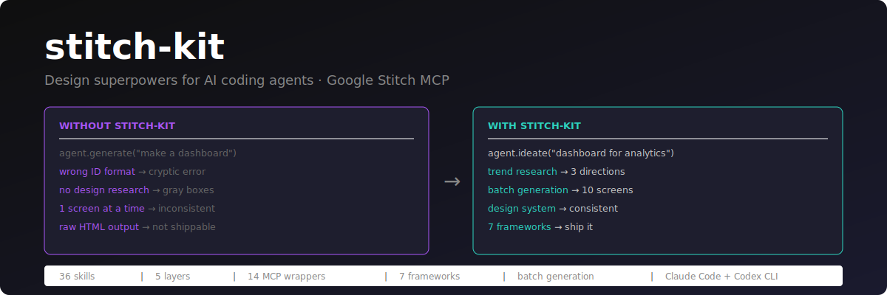
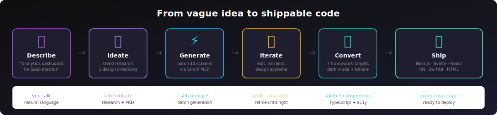
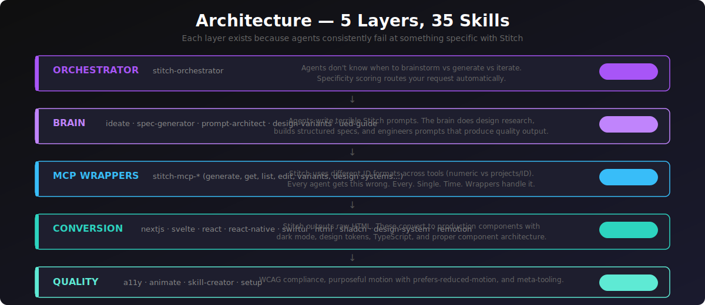

<p align="center">
  
</p>

# stitch-kit — Design superpowers for AI coding agents | Google Stitch MCP plugin

I built this because I got tired of watching Claude Code generate UIs that look like a government form from 2004. Gray boxes, blue buttons, zero taste. Meanwhile, Google's [Stitch](https://stitch.withgoogle.com) generates genuinely beautiful, pixel-perfect screens from text — but it's just a raw MCP tool sitting there, and no coding agent knows how to use it properly.

So I taught them.

stitch-kit is 35 skills that give AI coding agents actual design intelligence. Not "here's a prompt, good luck" — real ideation, visual research, prompt engineering that produces quality output, multi-screen batch generation, design systems, iteration loops, and conversion to production framework components. The whole pipeline from "I have a vague idea" to shippable code.

Your agent goes from design-blind to design-competent. You describe what you want (or just brainstorm out loud), and the agent researches trends, proposes 3 design directions with real color palettes and typography, generates a full PRD, creates up to 10 screens in Stitch in one shot, iterates until it looks right, and converts to Next.js, Svelte, React, React Native, SwiftUI, or HTML.

Works in Claude Code, Codex CLI, and any agent that speaks MCP.

---

## Install

### Quick install (recommended)

```bash
npx @booplex/stitch-kit
```

One command. It auto-detects your setup (Claude Code, Codex CLI, or both), installs the agent + skills, configures Stitch MCP, and tells you if anything's missing.

```bash
npx @booplex/stitch-kit update   # update to latest
npx @booplex/stitch-kit status   # check what's installed
```

After installing, sign in at [stitch.withgoogle.com](https://stitch.withgoogle.com) to complete Google auth.

### Claude Code plugin (optional, adds skills)

The NPX installer sets up the agent and MCP. For the full skill set (ideation, prompt engineering, design systems, iteration, conversion), also install the plugin inside Claude Code:

```bash
/plugin marketplace add https://github.com/gabelul/stitch-kit.git
/plugin install stitch-kit@stitch-kit
```

The agent works standalone with MCP tools, but skills add structured workflows that make the output noticeably better.

### Manual setup (if you prefer)

<details>
<summary>Claude Code — manual steps</summary>

```bash
# 1. Add Stitch MCP (remote HTTP server — needs API key from stitch.withgoogle.com/settings)
claude mcp add stitch --transport http https://stitch.googleapis.com/mcp \
  --header "X-Goog-Api-Key: YOUR-API-KEY" -s user

# 2. Install the plugin (inside Claude Code)
/plugin marketplace add https://github.com/gabelul/stitch-kit.git
/plugin install stitch-kit@stitch-kit
```
</details>

<details>
<summary>Codex CLI — manual steps</summary>

```bash
git clone https://github.com/gabelul/stitch-kit.git
cd stitch-kit && bash install-codex.sh
```

Then add Stitch MCP to `~/.codex/config.toml`:

```toml
[mcp_servers.stitch]
url = "https://stitch.googleapis.com/mcp"

[mcp_servers.stitch.headers]
X-Goog-Api-Key = "YOUR-API-KEY"
```

Get your API key at [stitch.withgoogle.com/settings](https://stitch.withgoogle.com/settings).

Use `$stitch-kit` to activate the agent or `$stitch-orchestrator` for the full pipeline.
</details>

---

## What actually happens when you use it

<p align="center">
  
</p>

Without stitch-kit, your agent sends Stitch a half-baked prompt, gets confused by ID formats, generates one screen, hands you raw HTML, and calls it a day. With stitch-kit:

1. **Think first** — `stitch-ideate` does something your coding agent literally cannot: design research. It fetches trends, analyzes competitor UIs, and proposes 3 distinct design directions with real hex colors, typography pairings, and mood descriptions. It's the design buddy your agent was missing.

2. **Generate smart** — The orchestrator detects whether your request needs ideation or can go straight to generation (there's a specificity scoring system — hex colors and layout details skip ideation, vague requests trigger it). It engineers a structured prompt, sends the full PRD to Stitch, and batch-generates up to 10 screens in one call. If there are more, it auto-continues.

3. **Iterate without starting over** — Edit screens with text prompts, generate design variants, apply design systems across multiple screens for visual consistency. The agent knows which Stitch tool to reach for (and more importantly, which ID format each one expects — because apparently Google couldn't pick one).

4. **Ship real code** — Convert to production components with dark mode, TypeScript, design tokens, and ARIA. Not "here's some JSX, figure it out" — proper Server/Client component split, theme integration, accessibility baked in.

There's also an agent definition (`agents/stitch-kit.md`) for both Claude Code and Codex — a Stitch-aware agent that knows the full skill set and doesn't hallucinate MCP tool names (which happens more than you'd think).

---

## Architecture

<p align="center">
  
</p>

Five layers. I didn't build 35 skills for fun — each layer exists because agents consistently fail at something specific with Stitch.

**The ID format thing deserves its own callout.** `generate_screen_from_text` wants `"3780309359108792857"`. `list_screens` wants `"projects/3780309359108792857"`. Pass the wrong one and you get a cryptic error. This is the #1 reason agents fail with raw Stitch MCP, and it's the reason I built 14 wrapper skills instead of letting agents call the API directly.

Details → [docs/architecture.md](docs/architecture.md)

---

## Skill anatomy

```
skills/[skill-name]/
├── SKILL.md        — what it does, when to use it, step-by-step workflow
├── examples/       — real examples so the agent copies patterns instead of guessing
├── references/     — design contracts, checklists (loaded only when needed)
└── scripts/        — fetch helpers, validators, code generators
```

The examples folder is the secret weapon. Agents produce dramatically better output when they have real patterns to copy instead of hallucinating boilerplate from training data. (I learned this the hard way after watching Claude generate the same broken Tailwind config 15 times in a row.)

---

## vs. the official Google Stitch Skills

Google published [6 skills](https://github.com/google-labs-code/stitch-skills). They cover the basics — enhance a prompt, convert to React, make a video walkthrough. Useful starting point.

stitch-kit has 35. It covers the full pipeline: conversational ideation with web research, multi-screen batch generation, design system management, iteration loops, and conversion to 7 frameworks. Every official skill has a local equivalent that does more:

| Official | stitch-kit | What's different |
|----------|-----------|-----------------|
| `design-md` | `stitch-design-md` | Adds Section 6 — design system notes that feed back into Stitch prompts for consistent multi-screen output |
| `enhance-prompt` | `stitch-ui-prompt-architect` | Two modes: (A) vague → enhanced, same as official; (B) Design Spec → structured `[Context][Layout][Components]` prompt. Mode B produces significantly better results. |
| `stitch-loop` | `stitch-loop` | Visual verification step, explicit MCP naming, DESIGN.md integration |
| `react-components` | `stitch-react-components` | MCP-native retrieval, optional DESIGN.md alignment |
| `remotion` | `stitch-remotion` | Common patterns (slideshow, feature highlight, user flow), voiceover, dynamic text |
| `shadcn-ui` | `stitch-shadcn-ui` | Init styles support, custom registries, validation checklist |

**What's entirely new (doesn't exist in the official repo):**
- `stitch-ideate` — conversational design agent that researches trends, proposes directions, produces PRDs, and batch-generates all screens
- `stitch-orchestrator` — end-to-end coordinator with smart ideation routing
- `stitch-mcp-*` wrappers — all 14 Stitch API tools wrapped with ID format safety (this alone saves hours of debugging)
- `stitch-mcp-edit-screens` — iterate on existing designs without regenerating from scratch
- `stitch-mcp-generate-variants` — native variant generation with creativity controls
- `stitch-mcp-upload-screens-from-images` — import screenshots for redesign workflows
- `stitch-mcp-create/update/list/apply-design-system` — full Stitch Design System lifecycle
- `stitch-ui-design-spec-generator` — structured spec before prompt (better output than pure prompt enhancement)
- Mobile targets: `stitch-react-native-components` + `stitch-swiftui-components`
- `stitch-design-system` — token extraction → CSS custom properties with dark mode
- `stitch-a11y` — WCAG 2.1 AA audit + auto-fixes
- `stitch-animate` — purposeful motion with `prefers-reduced-motion` handled
- `stitch-skill-creator` — meta-skill for extending the plugin

---

## Ship to any framework

Once your design is ready, pick your target:

| Target | Skill | What you get |
|--------|-------|-------------|
| Next.js 15 App Router | `stitch-nextjs-components` | Server/Client split, `next-themes`, TypeScript strict |
| Svelte 5 / SvelteKit | `stitch-svelte-components` | Runes API, scoped CSS, built-in transitions |
| Vite + React | `stitch-react-components` | `useTheme()` hook, Tailwind, no App Router overhead |
| HTML5 + CSS | `stitch-html-components` | No build step — PWA, WebView, Capacitor ready |
| shadcn/ui | `stitch-shadcn-ui` | Radix primitives, token alignment with Stitch palette |
| React Native / Expo | `stitch-react-native-components` | iOS + Android, `useColorScheme`, safe areas |
| SwiftUI | `stitch-swiftui-components` | iOS 16+, `@Environment(\.colorScheme)`, 44pt targets |

---

## Full skill reference

All 35 skills with descriptions, layers, and the ID format table → [docs/skills-index.md](docs/skills-index.md)

MCP API schemas (JSON Schema for all 14 Stitch tools) → [docs/mcp-schemas/](docs/mcp-schemas/)

---

## Prerequisites

- Stitch MCP — [setup guide](https://stitch.withgoogle.com/docs/mcp/setup) (Google account + API key required)
- Node.js for web framework conversions
- Xcode 15+ for SwiftUI, Expo CLI for React Native

---

Built by Gabi @ [Booplex.com](https://booplex.com) — because watching AI agents produce ugly UIs when beautiful tools exist was driving me nuts. Apache 2.0.
